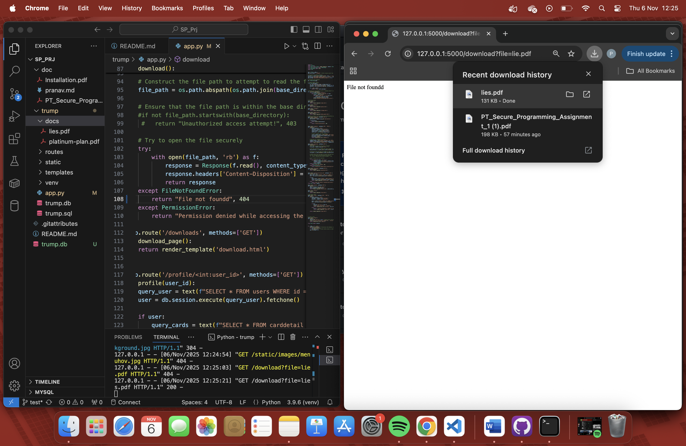

# Known
## Stored XSS
The site allows raw input for both username and comments. A malicious actor could add in code, for example a script tag, as either the username or cooment. What this would do is when the comment is "published", another user who opens the comments section would "execute" this line of code, basically carrying out the code left by the attacker. 

This is where the vulnerability in the code was spotted:

This is solved by using the {{text.comment }} without |safe which prevents the comment from being rendered as the intended.

## Reflected XSS
The site allows for raw input into the search bar. This means a malicious actor could misuse the search function by inputting malicious code. They could gain unnecessary information like information regrading the server and use it later in a sophisticated attack.

This is where the vulnerability in the code was spotted:

This is solved by using the {{text.comment }} without |safe which prevents the comment from being rendered as the intended.

## Path Traversal
The site allowed the download of files from /docs directory. This was because the user could input into the searc bar the localhost ip followed by "download?file=lie.pdf". Malicious actors could traverse directories like this and download restricted files.

This is where the vulnerability in the code was spotted:

 This was fixed by using os.path.normpath which ensures the path starts with the base directory preventing traversel.
# Unknown
## Cryptographic Failures
The password was not stored in a secure format in the db. It was not hashed. As per the lastes OWSP top 10 list, cryptographic failures were listed as the 2 hishest risk. This means if the db was compromised an attacker would have all the user passwords and it could be interpreted imediately. This is where the vulnerability in the code was spotted:

This was fixed by first hashing all the previous passwords and comparing the hashs of the user password and the hash of the user input. A function to carry out previously entered unhashed passwords:

And an updated login:

